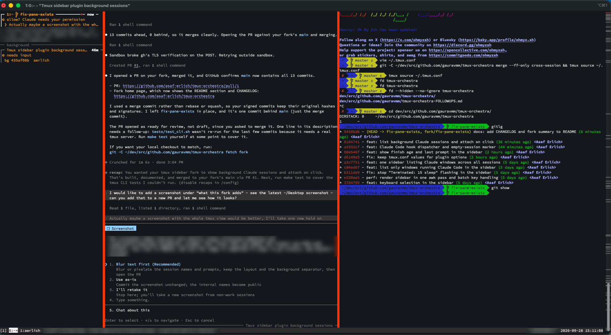

# tmux-orchestra

`tmux-orchestra` is a pure POSIX shell tmux plugin that exposes the `orchestra`
CLI for agent status, notifications, and prompt-published context, then renders
that state in a dedicated sidebar pane.


Its a shameless rip-off of cmux, vibe-coded in a day. Its only saving grace is that it is super handy. And has mouse support.

## What this fork adds



This is a fork of
[gauravmm/tmux-orchestra](https://github.com/gauravmm/tmux-orchestra). Compared
with upstream, it:

- lists **background Claude Code sessions** (`claude --bg`, FleetView) under a
  separator, and opens one in a new window with `claude attach` on Enter or a
  click
- keeps **one sidebar per tmux server**, listing Claude windows from every
  session and switching your client on Enter or a click
- lists **only windows running Claude Code**, so stale state never shows
- adds **keyboard selection** (Up/Down, `j`/`k`, mouse wheel, Enter)
- shows each window's **finish age**, **last prompt** and an
  **empty-session** marker
- redraws about **9x faster** (one tmux call and one awk pass per frame)
- fixes a **focus loop** that could crash the terminal, a sidebar that got
  stuck after its pane closed, and tmux.conf options being overwritten

See [CHANGELOG.md](CHANGELOG.md) for details.

## Highlights

- TPM-installable plugin entrypoint via `orchestra.tmux`
- `orchestra` CLI for status pills, progress, notifications, and agent state
- One long-lived `orchestra-render` sidebar per tmux server that lists the
  windows running Claude Code in every session (`session:window`) and follows
  focus across windows and sessions; Enter or a click on a window in another
  session switches your client there
- Background Claude Code sessions (`claude --bg`, `/background`, FleetView)
  listed under a `background` separator; Enter or a click opens one in a new
  window running `claude attach <id>`
- Bash and zsh prompt hooks for `cwd` / `branch` / last command
- Claude Code hook template (working), OpenCode plugin (working), Codex stub
- Shellcheck-clean shell implementation with tests under `make test`

## Prerequisites

- **tmux ≥ 3.4** (required for `focus-events` and modern pane targeting)
- **TPM** ([tmux-plugin-manager](https://github.com/tmux-plugins/tpm)) for one-line install

Check your tmux version:

```sh
tmux -V
```

If you don't have TPM, install it first:

```sh
git clone https://github.com/tmux-plugins/tpm ~/.tmux/plugins/tpm
```

Then add this to your `~/.tmux.conf` if it's not already there:

```tmux
run '~/.tmux/plugins/tpm/tpm'
```

## Installation

1. Add the plugin to `~/.tmux.conf`:

   ```tmux
   set -g @plugin 'gauravmm/tmux-orchestra'
   run '~/.tmux/plugins/tpm/tpm'
   ```

2. Reload tmux config:

   ```sh
   tmux source-file ~/.tmux.conf
   ```

3. Install the plugin with `prefix + I` (capital i).
4. Toggle the sidebar with `prefix + B`. There is one sidebar for the whole
   tmux server; it moves to whichever window (in whichever session) you focus.
5. *(Optional)* If your terminal has a Nerd-Font-patched font, enable nicer
   glyphs (braille spinners, `` branch, `●` unread dot, etc.):

   ```sh
   tmux set-option -g @orchestra_nerd_fonts on
   ```

   Or add `set -g @orchestra_nerd_fonts on` to `~/.tmux.conf` to make it stick.

## Prompt hooks

Source one of the prompt hooks from your shell startup file so the sidebar
shows cwd, git branch, and last command:

```sh
. ~/.tmux/plugins/tmux-orchestra/hooks/prompt.bash
# or
. ~/.tmux/plugins/tmux-orchestra/hooks/prompt.zsh
```

## Agent harness templates

Agent harnesses wire IDE/agent events (tool calls, permission prompts, idle)
to `orchestra` status updates so the sidebar shows what the agent is doing
in real time.

### Claude Code

Merge `settings.json` into `~/.claude/settings.json`:

```sh
# Backup first
cp ~/.claude/settings.json ~/.claude/settings.json.bak
# Merge (manual — review the diff)
```

Requires `jq` for JSON hook parsing.

#### Background sessions

Sessions the Claude Code daemon runs (`claude --bg`, sent to the background
from an interactive session, or launched from FleetView) run in no tmux
pane, so the hooks above never see them. The sidebar lists them after its
windows, below a `── background ──` separator, from `claude agents --json`
(needs `claude` and `jq` on the tmux server's `PATH`). Enter or a click on
one opens a new window in the viewing session, in the session's directory,
running `claude attach <id>`; while that window is open the session shows as
a normal window instead, and detaching closes the window.

The list is refreshed in the background every `@orchestra_bg_interval`
seconds (default 10; read when the sidebar opens). To turn it off:

```sh
set -g @orchestra_background off   # or: set -g @orchestra_bg_interval 0
```

### OpenCode

Copy the plugin to OpenCode's global plugins directory:

```sh
mkdir -p ~/.config/opencode/plugins
cp ~/.tmux/plugins/tmux-orchestra/hooks/opencode/orchestra.js ~/.config/opencode/plugins/
```

Restart OpenCode. The plugin auto-loads — no config changes needed.

### Codex

Stub template. See `hooks/codex/README.md` for the intended event mapping.

## CLI quick start

```sh
orchestra set-status phase build --icon '*' --color cyan
orchestra set-progress 0.42 --label 'Tests'
orchestra set-state running --action 'pytest'
orchestra notify --title 'Build' --body 'done'
orchestra clear-state
orchestra set-prompt 'fix the flaky test'
```

## Testing

Run the full shellcheck + test suite:

```sh
make test
```

## Key implementation decisions

- **Polling renderer, hook-assisted wakeups:** tmux does not emit hooks for
  arbitrary user-option writes, so the renderer uses a single `list-panes`
  poll every 125 ms and lets hooks wake it early on focus and rename events.
- **tmux options as the only datastore:** every state update is written into
  tmux options to keep the plugin installable without files, sockets, or extra
  daemons.
- **Single rendered status pill in v0.1:** the CLI accepts arbitrary keys, but
  the renderer only draws the `phase` pill so rendering stays within one tmux
  query per tick.
- **Prompt hook tmux budget:** the hooks batch writes into one `tmux` command
  after resolving the window id so they stay lightweight in interactive shells.

## Vibe Check

This is vibe coded over a day. The code quality is somewhere between "not great" and "its gonna take a flamethrower."

Here's an honest view of what needs to be done for more widespread use:

1. Better hooks for `opencode`.
2. More hooks (`claude code`, `codex`, etc.)
3. Any styling support.
4. More stable correlation of hooks to window. This one is pretty platform-specific.
5. More performant. We've just about reached the limit with what you can do with bash.
6. An agent skill, so the agent gets to decide what to put in the sidebar.
